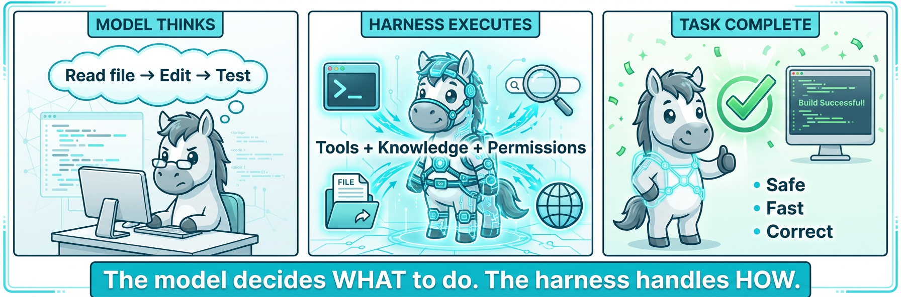
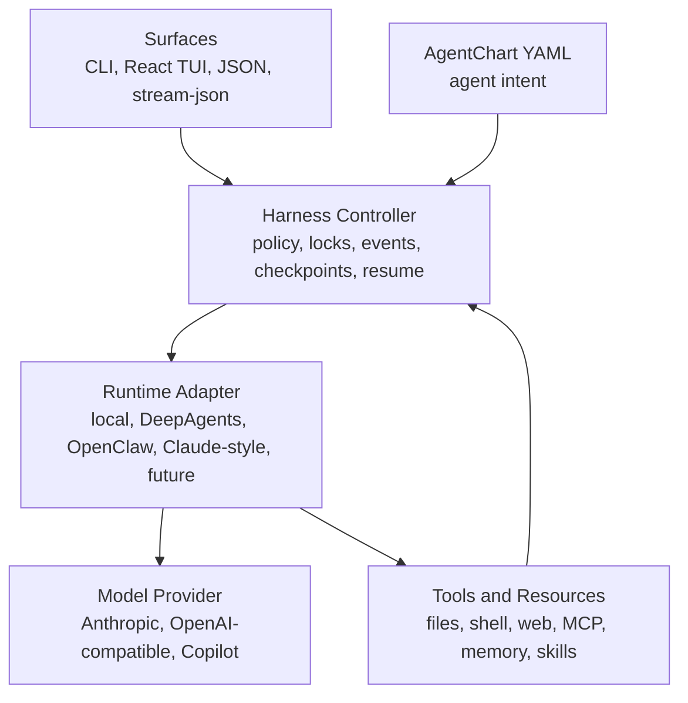

<h1 align="center">
  
  &nbsp;<code>ac</code> — AgentChart
</h1>

<p align="center">
  Declarative agent charts, inspectable harness infrastructure, and durable local execution.
</p>

<p align="center">
  <a href="#quick-start"></a>
  <a href="#architecture"></a>
  <a href="#high-availability-mvp"></a>
  <a href="LICENSE"></a>
</p>

<p align="center">
  
  
  
  <a href="https://github.com/lizhebio/AgentChart/actions/workflows/ci.yml"></a>
</p>

AgentChart is an open agent-harness project. It separates three things that are
often mixed together in agent systems:

| Layer | What It Means | In This Repo |
|---|---|---|
| **AgentChart** | A declarative package describing an agent's runtime intent: model, tools, workspace, permissions, session, workflow, and adapter-specific extensions. | YAML schema and MVP chart examples in `ohmo/harness_mvp.py` |
| **Harness** | The infrastructure around the model: tool execution, policy, state, memory, hooks, UI, sessions, events, retries, checkpoints, and resume. | `src/agentchart/` |
| **Agent Application** | A product or personal agent built on top of a harness, with channels, identity, memory, and domain behavior. | `ohmo/` |

The goal is not just to run an LLM loop. The goal is to make agent execution
portable, observable, resumable, and testable.

<p align="center">
  
</p>

## Architecture

AgentChart is organized around a portable chart, a durable controller, and one
or more runtime adapters.



### Repository Map

| Path | Role |
|---|---|
| `src/agentchart/cli.py` | Primary CLI entry point for `agentchart` and `ac` |
| `src/agentchart/adapters/` | Runtime adapters that compile AgentCharts into external agent runtimes |
| `src/agentchart/engine/` | Streaming agent loop and query execution |
| `src/agentchart/tools/` | Tool schemas, execution boundaries, and tool registry |
| `src/agentchart/permissions/` | Permission modes and command/path admission |
| `src/agentchart/hooks/` | PreToolUse/PostToolUse lifecycle hooks |
| `src/agentchart/skills/` | On-demand procedural knowledge loading |
| `src/agentchart/plugins/` | Plugin loading for commands, hooks, agents, and skills |
| `src/agentchart/memory/` | Persistent memory paths and search helpers |
| `src/agentchart/state/` | App/session state storage |
| `src/agentchart/tasks/` | Background task lifecycle |
| `src/agentchart/swarm/` | Team, subagent, mailbox, and worktree coordination |
| `src/agentchart/ui/` | Terminal UI runtime and backend protocol |
| `frontend/terminal/` | React/Ink terminal frontend |
| `ohmo/harness_mvp.py` | High-availability local AgentChart runner |
| `ohmo/` | Personal-agent application built on AgentChart |
| `docs/` | Harness research, MVP design, comparison matrix, and examples |

### Runtime Boundary

AgentChart keeps the portable chart small and pushes runtime-specific behavior
under adapters or extensions. This matters because different agent runtimes have
different semantics for prompt assembly, tool admission, transcript handling,
MCP lifecycle, sandboxing, channel binding, and cleanup.

The current repo has two practical execution paths:

| Path | Command | Purpose |
|---|---|---|
| Interactive harness | `ac` or `agentchart` | Run the full CLI/TUI agent harness with model providers, tools, plugins, memory, and permissions |
| Local durable MVP | `ohmo harness ...` | Run a deterministic chart without an LLM provider to test controller durability |

Planned adapters should compile the same AgentChart intent into native runtime
surfaces while preserving each runtime's semantics. The current recommended
order is DeepAgents first, then OpenClaw, then more delicate Claude-style
runtime compatibility.

## Quick Start

### Install From Source

```bash
git clone https://github.com/lizhebio/AgentChart.git
cd AgentChart
uv sync --extra dev
```

Check the primary entry points:

```bash
uv run agentchart --version
uv run ac --version
```

The supported command names are `agentchart`, `ac`, and `ohmo`. Legacy command
names are intentionally not kept.

### Run The Agent Harness

Configure a provider, then start an interactive session:

```bash
export ANTHROPIC_API_KEY=your_key
export ANTHROPIC_MODEL=claude-3-5-sonnet-latest
uv run ac
```

For Anthropic-compatible gateways such as Kimi:

```bash
export ANTHROPIC_BASE_URL=https://api.moonshot.cn/anthropic
export ANTHROPIC_API_KEY=your_kimi_api_key
export ANTHROPIC_MODEL=kimi-k2.5
uv run ac
```

For OpenAI-compatible providers:

```bash
uv run ac --api-format openai \
  --base-url "https://api.openai.com/v1" \
  --api-key "sk-..." \
  --model "gpt-4o-mini"
```

### Non-Interactive Mode

```bash
# Plain text output
uv run ac -p "Inspect this repository and list the top 3 architecture risks"

# JSON output for scripts
uv run ac -p "List the available tools" --output-format json

# Streaming events
uv run ac -p "Summarize the harness architecture" --output-format stream-json
```

### One-Click Install

The install script handles OS detection, dependency checks, package install, and
React TUI setup when Node.js is available.

```bash
curl -fsSL https://raw.githubusercontent.com/lizhebio/AgentChart/main/scripts/install.sh | bash
```

Useful flags:

| Flag | Description |
|---|---|
| `--from-source` | Clone the repo and install in editable mode |
| `--with-channels` | Install optional IM channel dependencies |

## High-Availability MVP

The MVP runner proves the controller substrate without depending on an LLM
provider. It executes a local AgentChart deterministically and records durable
state.

```bash
# Generate a sample chart
uv run ohmo harness sample --output agentchart.mvp.yaml --cwd .

# Validate chart and local storage
uv run ohmo harness doctor agentchart.mvp.yaml

# Run the chart
uv run ohmo harness run agentchart.mvp.yaml

# Inspect the latest run
uv run ohmo harness status latest

# Resume an interrupted or failed run
uv run ohmo harness resume latest agentchart.mvp.yaml
```

Minimal chart shape:

```yaml
apiVersion: agentchart.dev/v0
kind: AgentChart
metadata:
  name: mvp-local-smoke
spec:
  runtimeClass:
    name: mvp-local
  model:
    primary: local-deterministic
  tools:
    allow: [read_file, write_file, shell, record_note]
  permissions:
    mode: restricted
  workspace:
    cwd: /absolute/project/path
    isolation: sandbox
  session:
    persistence: runtime
    resume: true
    checkpoint:
      enabled: true
  workflow:
    retries:
      maxAttempts: 2
      backoffSeconds: 0.1
    timeoutSeconds: 30
    steps:
      - id: write-proof
        tool: write_file
        args:
          path: .agentchart-mvp/proof.txt
          content: "AgentChart MVP harness is alive.\n"
        mutates: true
      - id: read-proof
        tool: read_file
        args:
          path: .agentchart-mvp/proof.txt
      - id: shell-proof
        tool: shell
        args:
          command: test -s .agentchart-mvp/proof.txt
```

Durability properties implemented by the MVP:

| Property | Implementation |
|---|---|
| Atomic run state | `run.json` uses temp file, `fsync`, and `os.replace` |
| Append-only trace | `events.jsonl` records lifecycle, tools, checkpoints, and errors |
| Run locking | `.lock` prevents concurrent mutation of the same run |
| Resume | Completed step ids are persisted and skipped |
| Recovery | Resuming a stale `running` state records recovery before continuing |
| Checkpoints | Mutating steps create checkpoint directories before execution |
| Heartbeats | `heartbeat_at` is updated during execution |
| Policy guard | Workspace paths and dangerous shell fragments are denied |

See [`docs/HARNESS_MVP_HIGH_AVAILABILITY.md`](docs/HARNESS_MVP_HIGH_AVAILABILITY.md)
for the detailed design.

## Provider Compatibility

AgentChart supports three API formats.

| Format | How To Select | Typical Use |
|---|---|---|
| Anthropic | Default, or `--api-format anthropic` | Claude and Anthropic-compatible gateways |
| OpenAI-compatible | `--api-format openai` | OpenAI, DashScope, DeepSeek, Groq, Ollama, internal gateways |
| GitHub Copilot | `--api-format copilot` | Use an existing Copilot subscription through device auth |

Environment variables use the AgentChart namespace:

```bash
export AGENTCHART_API_FORMAT=openai
export AGENTCHART_BASE_URL=https://dashscope.aliyuncs.com/compatible-mode/v1
export AGENTCHART_MODEL=qwen3.5-flash
export OPENAI_API_KEY=sk-...
uv run ac
```

GitHub Copilot login:

```bash
uv run ac auth copilot-login
uv run ac --api-format copilot
uv run ac auth status
```

## Harness Capabilities

AgentChart's main harness includes the pieces needed to turn a model into a
working agent, while keeping those pieces inspectable and replaceable.

| Capability | Implementation |
|---|---|
| Agent loop | Streaming model calls, tool-use cycle, tool result feedback |
| Tools | File I/O, shell, search, web, MCP, tasks, background agents, config, skill loading |
| Permissions | Permission modes, path rules, command denial, approval surfaces |
| Hooks | PreToolUse/PostToolUse events for policy and automation |
| Skills | Markdown skills loaded on demand from configured skill directories |
| Plugins | Commands, hooks, agents, and skill bundles |
| Memory | Persistent memory files and project-level context discovery |
| Sessions | Resume, named sessions, history, and state storage |
| Swarm | Team lifecycle, subagent spawning, mailboxes, and worktree isolation |
| UI | CLI, React/Ink TUI, JSON output, and stream-json output |

The harness chooses boring, inspectable interfaces: Pydantic schemas for tool
inputs, JSON-compatible event/state files where possible, explicit permission
checks before mutation, and testable controller behavior.

## AgentChart vs Harness vs Full Agent

These terms are intentionally separate:

| Term | Short Definition | Example |
|---|---|---|
| AgentChart | The declaration of what an agent run should be | YAML with model, tools, permissions, workflow |
| Harness | The machinery that makes the run happen reliably | `src/agentchart` tool loop, policy, state, UI |
| Full agent | A productized agent with identity, channels, domain memory, and UX | `ohmo`, Hermes-style personal agents, team agents |

An AgentChart is like a deployment manifest. A harness is like the runtime and
control plane. A full agent is an application assembled from those pieces plus
domain behavior.

## Development

```bash
git clone https://github.com/lizhebio/AgentChart.git
cd AgentChart
uv sync --extra dev
uv run --extra dev pytest -q
```

Focused checks used for the MVP path:

```bash
uv run --extra dev pytest \
  tests/test_ohmo/test_harness_mvp.py \
  tests/test_config/test_paths.py \
  tests/test_commands/test_cli.py \
  tests/test_ui/test_react_launcher.py \
  tests/test_ui/test_react_backend.py \
  -q
```

Build a wheel:

```bash
uv build --wheel
```

## Documentation

| Document | Purpose |
|---|---|
| [`docs/HARNESS_MVP_HIGH_AVAILABILITY.md`](docs/HARNESS_MVP_HIGH_AVAILABILITY.md) | Durable local runner design |
| [`docs/AGENTCHART_HARNESS_AGENT_RELATIONSHIP_ZH.md`](docs/AGENTCHART_HARNESS_AGENT_RELATIONSHIP_ZH.md) | Chinese explanation of AgentChart, harness, and full agents such as Hermes |
| [`docs/DEEPAGENTS_ADAPTER.md`](docs/DEEPAGENTS_ADAPTER.md) | First external runtime adapter for compiling AgentCharts to DeepAgents |
| [`docs/HARNESS_RUNTIME_COMPARISON.md`](docs/HARNESS_RUNTIME_COMPARISON.md) | AgentChart, DeepAgents, OpenClaw, Claude Code, Codex comparison |
| [`docs/HARNESS_TAXONOMY_MATRIX.md`](docs/HARNESS_TAXONOMY_MATRIX.md) | Capability taxonomy for harness runtimes |
| [`docs/SHOWCASE.md`](docs/SHOWCASE.md) | Practical usage examples |
| [`CONTRIBUTING.md`](CONTRIBUTING.md) | Contributor workflow |
| [`CHANGELOG.md`](CHANGELOG.md) | User-visible changes |

## Roadmap

| Phase | Goal | Deliverable |
|---|---|---|
| 1 | Prove controller durability | `mvp-local` runner with locks, events, checkpoints, resume |
| 2 | Stabilize chart schema | Small portable AgentChart spec plus extension fields |
| 3 | Add library adapter | DeepAgents adapter |
| 4 | Add product runtime adapter | OpenClaw adapter |
| 5 | Extend runtime compatibility | Claude-style plugin, skill, MCP, and permission semantics |
| 6 | Evaluate whole runs | Trace, tool, policy, state, safety, cost, and resume metrics |

## Contributing

Good contributions make the architecture easier to inspect, test, and adapt.
Useful areas include:

| Area | Examples |
|---|---|
| Chart schema | Portable fields, validation, examples, extension conventions |
| Controller | Resume semantics, trace format, state migration, checkpoint policy |
| Runtime adapters | DeepAgents, OpenClaw, Claude-style, local providers |
| Tools | Safer execution boundaries, richer schemas, better failure handling |
| Evaluation | Run-level metrics, trace assertions, safety tests, benchmark harnesses |
| Documentation | Architecture guides, adapter notes, reproducible examples |

## License

MIT — see [LICENSE](LICENSE).
