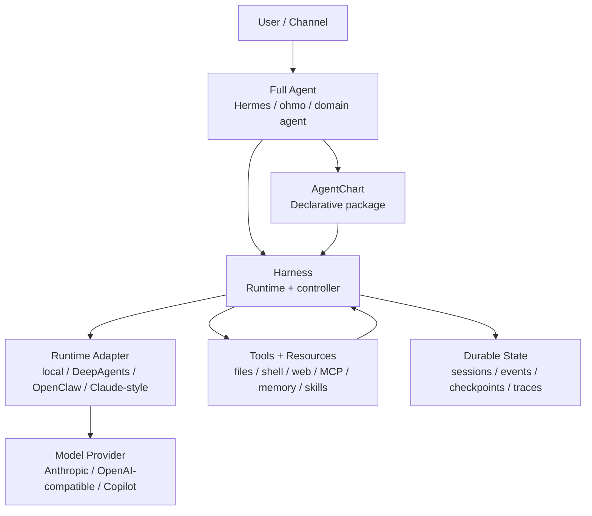
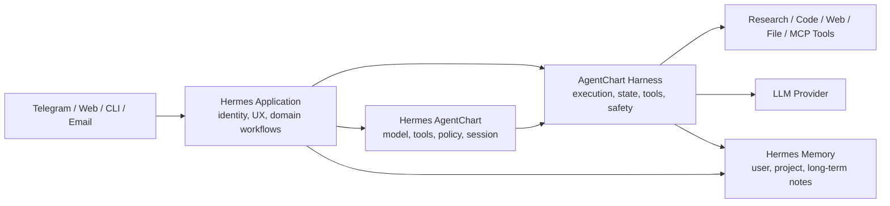

# AgentChart、Harness 与完整智能体的关系

这份文档回答一个核心问题：

> AgentChart、harness，以及一个完整的智能体如 Hermes，到底是什么关系？它们有什么区别？

一句话概括：

> **AgentChart 是声明式规格，harness 是运行时基础设施，Hermes 这类完整智能体是基于规格和运行时做出来的产品化 agent。**

它们不是三个互相替代的东西，而是三层不同抽象。

## 三层模型

| 层级 | 关注点 | 典型问题 | 在 AgentChart 仓库中的对应 |
|---|---|---|---|
| AgentChart | 这个 agent 应该如何被声明和部署 | 用什么模型？允许哪些工具？工作目录在哪里？权限模式是什么？能否 resume？ | AgentChart YAML / chart schema / `ohmo/harness_mvp.py` 中的 chart 定义 |
| Harness | 如何可靠地把声明跑起来 | 如何调用模型？如何执行工具？如何做权限检查、状态持久化、checkpoint、trace、resume？ | `src/agentchart/` 和 MVP controller |
| 完整智能体 | 面向用户或场景的成品 agent | 它是谁？服务谁？记住什么？接入哪些渠道？有什么长期目标和人格/领域能力？ | `ohmo/`，以及 Hermes 这类完整 agent 应用 |

可以把它们理解成：

| 类比 | 对应概念 |
|---|---|
| Kubernetes YAML / Helm Chart | AgentChart |
| Kubernetes control plane + runtime | Harness |
| 一个真实上线的 SaaS 服务 | Hermes 这类完整智能体 |

或者换成更贴近 agent 的类比：

| 类比 | 对应概念 |
|---|---|
| 菜谱 | AgentChart |
| 厨房、厨具、流程、安全规范、库存记录 | Harness |
| 一家具体餐厅和它的招牌菜、服务方式、用户关系 | 完整智能体 |

## 架构关系



这张图表达的是：

1. 用户通常不会直接“使用一个 harness”，而是使用一个完整智能体。
2. 完整智能体可以用 AgentChart 描述自己的运行意图。
3. Harness 负责把这个意图实际跑起来。
4. Harness 可以接不同 runtime adapter、模型供应商、工具、记忆和渠道。
5. 运行过程中的状态、事件、checkpoint、trace 应该由 harness/controller 负责，而不是散落在业务代码里。

## AgentChart 是什么

AgentChart 是一个声明式 agent package。

它描述“一个 agent run 应该长什么样”，而不是直接包含所有运行逻辑。

典型字段包括：

```yaml
apiVersion: agentchart.dev/v0
kind: AgentChart
metadata:
  name: hermes-research-agent
spec:
  runtimeClass:
    name: mvp-local
  model:
    primary: claude-or-compatible-model
  tools:
    allow: [read_file, write_file, shell, web_search, mcp]
  permissions:
    mode: restricted
  workspace:
    cwd: /workspace/project
    isolation: sandbox
  session:
    persistence: runtime
    resume: true
    checkpoint:
      enabled: true
  workflow:
    timeoutSeconds: 300
```

AgentChart 应该回答：

| 问题 | 示例 |
|---|---|
| 这个 agent 用什么 runtime？ | `mvp-local`、未来的 `deepagents`、`openclaw` |
| 用什么模型？ | Anthropic-compatible、OpenAI-compatible、Copilot |
| 能用哪些工具？ | 文件、shell、web、MCP、memory |
| 权限边界是什么？ | restricted、plan、full_auto |
| 工作目录在哪里？ | `/workspace/project` |
| 是否持久化和 resume？ | session persistence、checkpoint |
| 有没有 runtime-specific 配置？ | 放在 extensions 中 |

AgentChart 不应该负责：

| 不该由 AgentChart 负责 | 原因 |
|---|---|
| 真正执行工具 | 这是 harness 的职责 |
| 真正调用模型 API | 这是 runtime adapter / provider client 的职责 |
| 管理长期用户关系 | 这是完整智能体应用的职责 |
| 写死某个产品的渠道协议 | 应该由应用层或 adapter 处理 |
| 把所有 runtime 的私有语义压平成统一字段 | 容易破坏原 runtime 的真实行为 |

所以，AgentChart 的定位是：

> **一个可移植、可审计、可版本化的 agent 运行声明。**

## Harness 是什么

Harness 是包在模型外面的运行时基础设施。

模型提供推理能力，但模型本身不等于 agent。要让模型成为 agent，需要一整套外围系统：

| Harness 能力 | 说明 |
|---|---|
| Agent loop | 用户消息、模型回复、tool call、tool result、继续推理 |
| Tool execution | 文件、shell、web、MCP、任务、子代理等工具的真实执行 |
| Permission | 写文件、跑命令、访问路径、调用外部资源之前的检查 |
| Hooks | PreToolUse / PostToolUse 等生命周期扩展点 |
| State | session、history、run status、task state |
| Durability | atomic write、event log、checkpoint、resume |
| Observability | trace、events、tool call、error、cost、heartbeat |
| Memory | 项目记忆、用户记忆、长期知识、上下文注入 |
| Skills | 按需加载的过程知识和领域工作流 |
| UI / channel | CLI、TUI、JSON output、stream events、IM channel |
| Multi-agent | subagent、team、mailbox、worktree、background tasks |

在本仓库里，harness 的主要实现位于：

| 路径 | 职责 |
|---|---|
| `src/agentchart/engine/` | agent loop 和 query execution |
| `src/agentchart/tools/` | 工具 schema 和执行边界 |
| `src/agentchart/permissions/` | 权限模式、路径和命令规则 |
| `src/agentchart/hooks/` | 工具前后 hook |
| `src/agentchart/skills/` | skill 加载 |
| `src/agentchart/plugins/` | plugin 加载 |
| `src/agentchart/memory/` | memory 管理 |
| `src/agentchart/state/` | 状态存储 |
| `src/agentchart/tasks/` | 后台任务 |
| `src/agentchart/swarm/` | 多智能体协作 |
| `src/agentchart/ui/` | CLI/TUI 后端协议 |
| `ohmo/harness_mvp.py` | 高可用 MVP controller |

Harness 的定位是：

> **把一个声明式 agent 意图可靠地跑起来，并留下可恢复、可审计、可测试的运行证据。**

## 完整智能体如 Hermes 是什么

Hermes 这类完整智能体不是一个单纯的 chart，也不是一个单纯的 harness。

它是产品化之后的 agent application。

完整智能体通常包含：

| 组成 | 说明 |
|---|---|
| 身份 | 它是谁？有什么角色、语气、边界？ |
| 用户关系 | 它服务谁？记住哪些用户偏好、长期目标、交互历史？ |
| 领域能力 | 研究、写作、代码、运营、医学、生物、个人助理等专门能力 |
| 渠道 | CLI、网页、Telegram、Slack、Discord、Feishu、邮件等 |
| 长期记忆 | 用户画像、项目背景、偏好、历史结论 |
| 工作流 | 固定任务流程、主动提醒、定期任务、协作协议 |
| 安全策略 | 哪些事绝不能做？哪些事必须确认？ |
| 体验层 | UI、通知、消息格式、交互节奏 |
| 运维层 | 部署、监控、日志、恢复、版本升级 |

因此，Hermes 更像是：

> **一个基于 harness 和 AgentChart 规格构建出来的完整 agent 产品。**

如果 AgentChart 是“这个 agent 怎么部署和运行”的声明，harness 是“怎么可靠运行”的机器，那么 Hermes 是“真正面向用户完成长期任务的智能体”。

## 三者的边界

### AgentChart 负责声明，不负责执行

AgentChart 可以说：

```yaml
tools:
  allow: [read_file, write_file, shell]
permissions:
  mode: restricted
session:
  resume: true
```

但它不应该亲自执行 `shell`，也不应该亲自写 `events.jsonl`。

执行和记录是 harness 的职责。

### Harness 负责运行，不负责定义产品人格

Harness 可以：

- 检查一个 shell 命令是否允许执行。
- 调用工具。
- 写 checkpoint。
- 记录 trace。
- 恢复中断的 run。
- 把 tool result 送回模型。

但 harness 不应该写死：

- Hermes 的人格。
- Hermes 对某个用户的长期记忆。
- Hermes 应该接入哪个家庭群或公司 Slack。
- Hermes 的领域业务规则。

这些属于完整智能体应用层。

### 完整智能体负责用户价值，不应该重造底层 harness

Hermes 可以定义：

- 它是一个长期个人研究助手。
- 它记住用户研究方向。
- 它可以主动整理文献。
- 它可以接 Telegram 或邮件。
- 它有自己的长期任务和通知策略。

但 Hermes 不应该到处手写：

- 原子状态写入。
- checkpoint 协议。
- tool call trace。
- 权限系统。
- run lock。
- resume 逻辑。

这些应该复用 harness。

## 用 Hermes 举例

假设 Hermes 是一个完整个人智能体。

它可以这样分层：

| 层 | Hermes 中的内容 |
|---|---|
| AgentChart | Hermes 的模型、工具、权限、workspace、memory、session、workflow 声明 |
| Harness | 执行 Hermes 的 LLM loop、工具调用、权限检查、trace、checkpoint、resume |
| Hermes 应用层 | Hermes 的身份、用户画像、长期记忆、渠道接入、主动任务、领域工作流 |

一个合理的 Hermes 架构可能是：



这意味着：

1. Hermes 的“人设和产品体验”在 Hermes 应用层。
2. Hermes 的“运行声明”在 AgentChart。
3. Hermes 的“可靠执行能力”来自 harness。
4. Hermes 的“工具和资源”通过 harness 统一接入。
5. Hermes 的长期记忆可以被应用层管理，也可以通过 harness memory 机制接入。

## 为什么要分开

如果不分开，agent 项目很容易变成一团混合代码：

- prompt 在业务代码里。
- 工具调用在 controller 里。
- 权限判断散落在工具里。
- session 状态散落在 UI 和业务逻辑里。
- resume 只能靠猜。
- adapter 之间互相污染。
- 很难评估一次 run 到底发生了什么。

分开之后，可以得到更清晰的演化路线：

| 目标 | 分层后的好处 |
|---|---|
| 可移植 | 同一个 AgentChart 可以适配不同 runtime |
| 可审计 | Harness 统一记录事件、工具、权限、checkpoint |
| 可恢复 | Controller 统一处理 resume、lock、heartbeat |
| 可测试 | MVP local runtime 不依赖 LLM，也能测试底层可靠性 |
| 可产品化 | Hermes 这类应用可以专注用户价值，不重造底层运行机制 |
| 可扩展 | DeepAgents、OpenClaw、Claude-style runtime 可以作为 adapter 接入 |

## 当前仓库中的落地方式

当前 AgentChart 仓库已经有三个层次的初步落地：

| 层 | 当前状态 |
|---|---|
| AgentChart 声明 | MVP chart schema 和 sample chart 已存在 |
| Harness | `src/agentchart/` 提供 CLI harness、工具、权限、插件、memory、任务、多 agent 基础设施 |
| 高可用 controller MVP | `ohmo/harness_mvp.py` 提供 deterministic local runner、durable store、lock、checkpoint、resume、events |
| 完整 agent app | `ohmo/` 是一个基于 AgentChart 的 personal-agent app 雏形 |

这里的重点是：

> MVP runner 不是最终的完整智能体，而是为了证明 harness/controller 这层是可靠的。

它故意不依赖 LLM provider，这样可以测试：

- chart admission。
- workspace sandbox。
- 原子状态写入。
- append-only events。
- run lock。
- checkpoint。
- resume。
- retry。
- heartbeat。
- 危险命令拒绝。

这些能力稳定后，再接 DeepAgents、OpenClaw、Hermes 这类更复杂 runtime 或应用，才不容易把基础层做乱。

## 设计原则

### 1. AgentChart 保持小而稳定

AgentChart 的 portable 字段应该尽量少：

- model
- tools
- permissions
- workspace
- session
- memory
- workflow
- runtimeClass
- extensions

不要把每个 runtime 的所有细节都塞进核心字段。

### 2. Runtime-specific 语义放到 adapter 或 extensions

比如：

- DeepAgents 的 middleware。
- OpenClaw 的 channel binding。
- Claude-style runtime 的 prompt order、sidechain transcript、MCP lifecycle。
- Hermes 的产品化渠道和用户画像。

这些都不应该强行压平成一个统一字段。

### 3. Harness 记录一次 run，而不只记录最终答案

可靠 agent 的评估对象不应该只是最终回答，还应该包括：

- tool calls。
- permission decisions。
- retries。
- checkpoints。
- state transitions。
- errors。
- token/cost。
- recovery behavior。

### 4. 完整智能体复用 harness，不重造 harness

Hermes 应该把精力放在：

- 长期用户价值。
- 领域能力。
- 记忆策略。
- 渠道体验。
- 主动任务。
- 人机协作节奏。

而不是重复实现：

- lock。
- checkpoint。
- trace。
- resume。
- tool execution protocol。
- permission system。

## 最短结论

| 问题 | 答案 |
|---|---|
| AgentChart 是完整智能体吗？ | 不是。它是声明式 agent package / manifest。 |
| Harness 是完整智能体吗？ | 不是。它是让 agent 可靠运行的基础设施。 |
| Hermes 是 harness 吗？ | 不只是。Hermes 是一个完整智能体应用，内部可以使用 harness。 |
| AgentChart 和 harness 谁更底层？ | AgentChart 是声明层，harness 是执行层；二者互补，不是上下完全替代。 |
| Hermes 和 AgentChart 的关系？ | Hermes 可以用 AgentChart 声明自己的运行配置。 |
| Hermes 和 harness 的关系？ | Hermes 复用 harness 来执行工具、管理状态、做权限和恢复。 |

最终可以这样记：

> **AgentChart 描述 agent。Harness 运行 agent。Hermes 是被描述并被运行的完整 agent 产品。**
